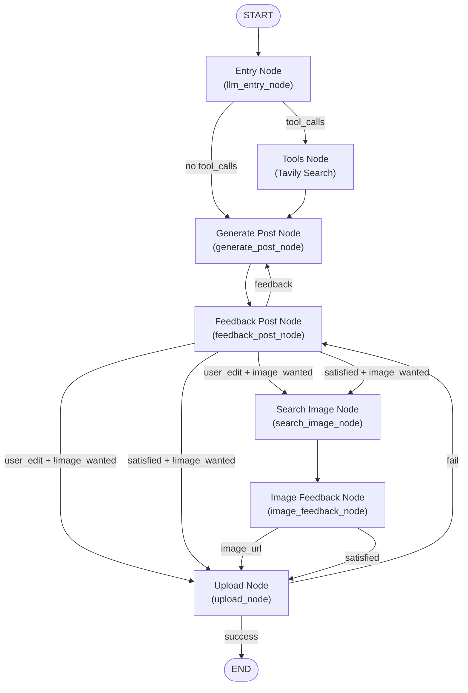

# Social Media Agent Platform

This platform is an AI-powered tool designed to automate content creation and posting for social media accounts. It leverages a LangGraph-based AI agent to generate, optimize, and publish posts, streamlining your social media workflow.

## Features
- **AI-Generated Content:** Automatically create professional posts tailored for your social media audience.
- **Image Suggestions:** Get smart image recommendations to enhance your posts.
- **Human-in-the-Loop:** Review, edit, and approve both post content and images before publishing, ensuring quality and relevance.
- **Real-Time Feedback:** Edit and provide feedback on generated content before publishing.
- **Multi-Platform Support:** Designed for LinkedIn and Twitter (with more platforms planned).

## How it Works

Below is a high-level flowchart of the AI agent's workflow, showing the nodes and decision points:

For a quick demo, see below:

## Demo Video

Curious how it works? Watch this quick demo:

## Current Status
- **LinkedIn Posting:** Fully functional. Authenticate with LinkedIn, generate posts (with or without images), and publish directly to your LinkedIn feed.
- **Twitter Integration:** Under development. Twitter authentication and posting features will be available soon.

## Technology Stack
- **Frontend:** Next.js (React) with Tailwind CSS for a modern, responsive UI.
- **Backend:** FastAPI (Python) for API endpoints and session management.
- **AI Workflow:** LangGraph orchestrates the agent's workflow, including content generation, human-in-the-loop feedback for both post content and images, and posting.

## Getting Started
1. Clone the repository.
2. Set up your environment variables for LinkedIn API credentials.
3. Run the backend and frontend servers.
4. Authenticate with LinkedIn and start automating your social media posts!

---

*Note: Twitter support is coming soon. Stay tuned for updates!*
